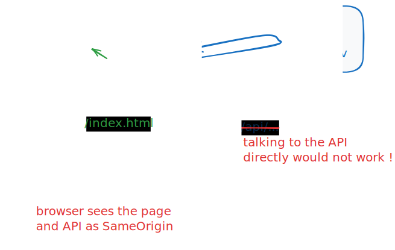

# frontend-pixels-war

Practical work assignment at Mines de Paris, UE22.

## What is PiXels War?

PiXels War is a real-time strategy game in which players compete to control a
map made up of pixels. Each pixel can be colored by a player, and the goal of
the game is to control as many pixels as possible. Players can also form
alliances to control larger areas of the map.

The difficulty of the game lies in the fact that a player can only change the
color of a pixel every 10 seconds, which makes strategy and planning essential
for success.

## The API

The API is accessible at `https://pixels-war.fly.dev`, where you will find:

- at the root, a frontend that looks like what you need to make  
  https://pixels-war.fly.dev/

- the online documentation (courtesy FastAPI) here:  
  https://pixels-war.fly.dev/docs

  for historical reasons there are two versions of the API that are
  documented, but **only version `v2` should be used**, version `v1` is
  obsolete and non-functional

## The Maps

As you can see on the frontend, there are several maps you can work on:
- specifically for your development, we recommend using the `TEST` map
  which has a timeout of 1 second, which is more comfortable for
  development than the other maps which have longer timeouts.
- the main `MAIN` map has a timeout of 10 seconds, and this is the
  map where the final competition takes place
- we have also created a map per group, if that can be useful

## Your Job

You are to write your own frontend; you can start from scratch, or be inspired
by the frontend provided in this repository, which will guide you further; in
that case, look at the TODOs in the js, then in the css.

### using vite to work around any CORS issue

In order to deal with CORS issues, we recommend using `vite` to serve your
frontend; the repo contains a `vite.config.js` file that is configured to proxy
requests to the API, so you can use it as follows:

```bash
npm install vite
npx vite
```

and then open `http://localhost:5173/pixels-war.html` (or another port, as
instructed in the output of vite) in your browser to see the frontend.

Like always, this terminal is then unusable, as it is occupied by the vite
server, so you will need to open another terminal if need be.

Here's how it works



## Deployment notes

FYI, the server is written in Python using FastAPI; it is deliberately, and in
particular it does not support persistence, meaning that when the server
restarts, all the data is lost.  
Also, as this server is hosted on `fly.io`, it is configured to shutdown itself
down after some inactivity, and restart when a new request arrives.  
This means that if you leave the server alone for a while, it will shutdown, and
the next request will trigger a restart, which will (1) restart the maps from
the predefined configuration, causing, and (2) need a delay of about 10 seconds.
