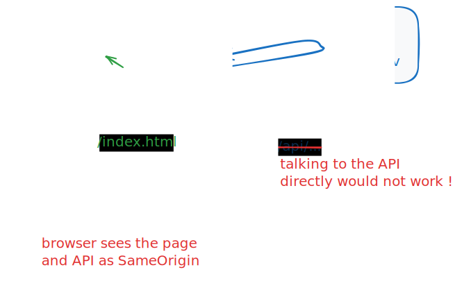

# frontend-pixels-war

Practical work assignment at Mines de Paris, UE22.

## What is PiXels War?

PiXels War is a real-time strategy game in which players compete to control a
map made up of pixels. Each pixel can be colored by a player, and the goal of
the game is to control as many pixels as possible. Players can also form
alliances to control larger areas of the map.

The difficulty of the game lies in the fact that a player can only change the
color of a pixel every 10 seconds, which makes strategy and planning essential
for success.

## The server

The game is accessible at `https://pixels-war.fly.dev`, where you will find:

- at the root, a frontend that looks like what you need to make  
  https://pixels-war.fly.dev/

- an API that implements the game logic, and that you will have to leverage to
  build your own frontend  
  the API online documentation (courtesy FastAPI) here:  
  https://pixels-war.fly.dev/docs

  for historical reasons there are two versions of the API that are
  documented, but **only version `v2` should be used**, version `v1` is
  obsolete and non-functional

## The frontend

Essentially the frontend allows you to
- choose a backend server; in your own implementation you should skip this part; it's OK that your own app can talk only to one server, it makes things easier with respect to CORS issues, more on this in the section on using `vite` below
- choose a map among those available at the server
- display the selected map (button 'Display')
- choose a color for the next pixel
- click on a pixel to change its color (if the timeout allows it)
- and otherwise continuously see changes made by other users

## The maps

Each server hosts several maps:
- specifically for your development, we recommend using the `TEST` map
  which has a timeout of 1 second, which is more comfortable for
  development than the other maps which have longer timeouts
- we have also created a map per group, if that can be useful
- the `MAIN` map is the one where the final competition takes place - tentatively

## Your job

You are to write your own frontend; you can start from scratch, or be inspired
by the starter code provided in this repository, which will guide you further;
in that case, look at the TODOs in the js, then in the css.

Again note that

- the starter code already has the logic to probe the server for its list of
  maps
- the starter code has no dialog to choose a server; it's OK that your final
  code can only talk to one server, and in fact this is recommended to avoid
  CORS issues

## `fetch()`: hints about passing parameters to the API

You will need to pass parameters to the API, through your calls to `fetch()`  
Here are a few tips about that (and feel free to look around for more):

- in order to add a header to your request, you can do as follows:

```js
fetch('/api/v2/xxx', {
  method: 'POST', // or 'GET' or whatever
  headers: {
    'API-KEY': 'your-api-key'
  },
})
```

- in order to pass a JSON body to a POST request, you can do as follows:

```js
fetch('/api/v2/xxx', {
  method: 'POST',
  body: JSON.stringify({
    'key1': 'value1',
    'key2': 'value2'
  })
})
```

- in order to pass along any cookie that the server has set, you need to add the `credentials` option as follows:

```js
fetch('/api/v2/xxx', {
  method: 'POST',
  credentials: 'include'
})
```

- also there are no query parameters in the API, so no worries about that

See also
<https://backend.info-mines.paris/fastapi-basics/#more-kinds-of-parameters> for
a picture about how these various kinds of parameters end up in the actual HTTP
request.

## Using `vite` to work around any CORS issue

In order to deal with CORS issues, we recommend using `vite` to serve your
frontend; the repo contains a `vite.config.js` file that is configured to proxy
requests to the API, so you can use it as follows:

```bash
npm install vite
npx vite
```

and then open <http://localhost:5173/pixels-war.html> (or another port, as
instructed in the output of vite) in your browser to see the frontend.

Like always, this terminal is then unusable, as it is occupied by the vite
server, so you will need to open another terminal if need be.

This means your code will **exclusively issue requests to `/api/v2/xxx`**  
i.e. **with no https://pixels-war.fly.dev prefix**,  
and vite will take care of proxying them to the server  
which is configured in `vite.config.js` as `https://pixels-war.fly.dev`.

Here's how it works



See also https://frontend.info-mines.paris/vite-nb/ for how to install and use
vite in general.

## Deployment notes

FYI, the server is written in Python using FastAPI; it is deliberately simple
and rustic, and in particular it does not support persistence, meaning that when
the server restarts, all the data is lost.  
Also, as this server is hosted on `fly.io`, it is configured to shutdown itself
down after some inactivity, and restart when a new request arrives.  
This means that if you leave the server alone for a while, it will shutdown, and
the next request will trigger a restart, which will

1. restart the maps from the predefined configuration,
2. and need a delay of about 10 seconds before it can respond to the first request

## If you're done early

you can either

- improve the UI - e.g. add a tool for picking a color from a pixel, use a slider to display remaining time, add animations, or a 3d viewer, or sound effects...
- or even implement a bot to play the game automatically
  - either stupidly (the bot is in charge of uploading an image)
  - or more cleverly (the bot is in charge of picking the next pixel to color,
    based on the current state of the map)
- try to figure out a way to cheat the timeout thing
- if you're really ambitious, you can vibe code a phone app that can play the game
- or whatever else you can think of...
